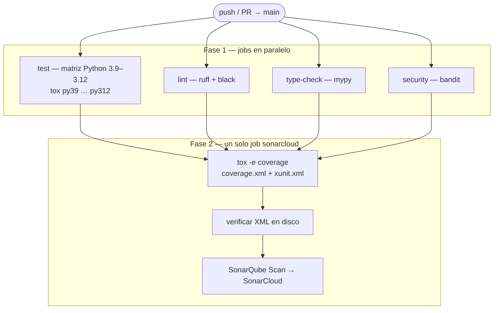

# kata-devops

Kata de **DevOps y Python**: dominio pequeño con **pytest**, calidad automatizada con **tox** y **GitHub Actions**, análisis estático y cobertura en **SonarCloud**.

[](https://sonarcloud.io/summary/new_code?id=EstebanMa12_kata-devops)
[](https://sonarcloud.io/summary/new_code?id=EstebanMa12_kata-devops)
[](https://github.com/EstebanMa12/kata-devops/actions/workflows/ci.yml)

## Descripción funcional

El código bajo `src/` implementa ejercicios aislados (sin framework web ni base de datos):

| Módulo | Responsabilidad |
|--------|-----------------|
| **`dictionary`** | Diccionario en memoria: alta de palabra–definición, búsqueda por clave (devuelve `"Not found"` si no existe) y listado de todas las entradas. |
| **`costs`** | Cálculo del total a pagar: suma precios de ítems conocidos en un mapa de costes, aplica impuesto y redondea a dos decimales. |
| **`concatenate`** | A partir de una lista de palabras, toma la **n-ésima letra** de la **n-ésima** palabra (índice 0-based) cuando la palabra tiene longitud suficiente, y concatena esos caracteres en un `str`. |
| **`generate_config`** | Genera un fichero **YAML** de configuración (nombre de app, versión, entorno, debug, lista de endpoints, tipo impositivo) vía API programática o CLI `generate-config` / `python -m src.generate_config`. |

Los comportamientos concretos están cubiertos por los tests en `tests/`.

## Requisitos

- **Python** 3.9, 3.10, 3.11 o 3.12 (alineado con CI y `pyproject.toml`).
- **pip** reciente (recomendado: `python -m pip install -U pip`).

No hay dependencias de runtime externas: solo biblioteca estándar.

## Instalación

### Entorno de desarrollo (editable + herramientas)

Desde la raíz del repositorio:

```bash
python -m venv .venv
source .venv/bin/activate   # Windows: .venv\Scripts\activate
pip install -U pip
pip install -e ".[dev]"
```

Equivale a usar el fichero `requirements.txt` (apunta al proyecto editable con extras `dev`).

### Generar un wheel

Tras instalar dependencias de desarrollo (`pip install -e ".[dev]"`):

```bash
python -m build
```

Los artefactos quedan en `dist/`.

### Solo el paquete (sin herramientas de desarrollo)

```bash
pip install .
```

## Cómo ejecutar los tests

### Con tox (recomendado; igual que en CI)

```bash
pip install tox
tox              # todos los entornos definidos
tox -e py312     # solo tests con Python 3.12
tox -e lint
tox -e type
tox -e security
tox -e coverage  # genera coverage.xml y xunit.xml (p. ej. para SonarCloud)
```

### Con pytest directamente

Con el entorno activado y dependencias de desarrollo instaladas:

```bash
pytest tests/ -v
pytest tests/ --cov=src --cov-config=pyproject.toml --cov-report=term-missing
```

## CLI: generar `config.yaml`

Tras `pip install -e .` (o `pip install .`):

```bash
generate-config
```

Escribe `config.yaml` en el directorio actual con valores por defecto (ver `src/generate_config.py`).

También puedes invocar el módulo:

```bash
python -m src.generate_config
```

## Pipeline CI/CD

Disparadores: **push** y **pull_request** hacia la rama `main`.

En GitHub Actions, la **puerta** entre la fase paralela y Sonar es el campo `needs: [test, lint, type-check, security]` del job `sonarcloud`: ese job no arranca hasta que los cuatro hayan terminado correctamente.



Flujo en palabras:

1. **test** — por cada versión de Python se instala **tox** y se ejecuta el entorno correspondiente (`py39` … `py312`): solo **pytest**.
2. **lint** — **ruff** y **black** (`tox -e lint`).
3. **type-check** — **mypy** sobre `src/` (`tox -e type`).
4. **security** — **bandit** (`tox -e security`).
5. **sonarcloud** (solo si los cuatro jobs anteriores pasan) — de nuevo checkout completo, Python 3.12, **tox -e coverage** (pytest + cobertura Cobertura + JUnit), comprobación de ficheros y envío del análisis a **SonarCloud** con `SONAR_TOKEN` (y `GITHUB_TOKEN` para integración con GitHub).

La cobertura que ve SonarCloud se genera **en este último job**, no en la matriz de `test`.

## Estructura del repositorio

| Ruta | Descripción |
|------|-------------|
| `src/` | Código del paquete; ver tabla [Descripción funcional](#descripción-funcional). |
| `tests/` | Tests pytest alineados con los módulos anteriores. |
| `pyproject.toml` | Metadatos del proyecto, extras `dev`, script `generate-config`, black / ruff / mypy / pytest / coverage. |
| `tox.ini` | Entornos reutilizados en local y en CI. |
| `.github/workflows/ci.yml` | Workflow descrito en [Pipeline CI/CD](#pipeline-cicd). |
| `sonar-project.properties` | Rutas de informes y ajustes del análisis en SonarCloud. |

## Licencia

MIT (ver `pyproject.toml`).
